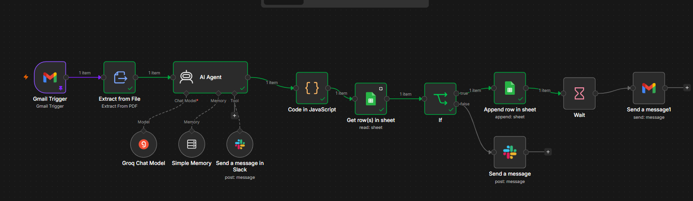

# AI-Assisted Invoice Validation and Duplicate Detection with n8n

This repository contains a sanitized portfolio version of an invoice-processing workflow that I built with n8n. It receives invoice PDFs by email, extracts text, structures invoice fields, checks basic anomalies, checks the invoice register for a duplicate invoice number, records accepted invoices, sends review alerts, and sends a vendor acknowledgement.

The public workflow contains no live credentials or private resource IDs. Follow [`SETUP.md`](SETUP.md) to connect your own services.

## Problem

Invoice processing often starts in an inbox and ends in a spreadsheet or accounting system. Manual copying makes it easy to miss incomplete invoices, arithmetic problems, date problems, or duplicate invoice numbers.

This workflow automates the repeatable intake and validation steps. It keeps exception handling visible so that a finance reviewer can investigate a problem instead of allowing the automation to make an irreversible payment decision.

## What the System Does

The workflow can:

- Watch Gmail for incoming messages and download attachments.
- Extract text from PDF invoice files.
- Use an AI agent to structure invoice fields and classify the expense.
- Flag missing fields and basic invoice anomalies for review.
- Parse the agent output into a stable JSON object.
- Search a Google Sheets invoice register by invoice number.
- Route a potential duplicate to Slack.
- Append a new invoice to the register when no matching invoice number exists.
- Wait before sending a vendor acknowledgement email.

## Architecture

```text
Gmail
  |
  v
PDF text extraction
  |
  v
AI-assisted field extraction and classification
  |
  v
Structured JSON
  |
  v
Google Sheets duplicate lookup
  |
  +--> Existing invoice number --> Slack review alert
  |
  +--> New invoice number ------> Record invoice --> Wait --> Gmail acknowledgement
```



## Technology

- n8n
- Gmail
- Extract From File
- n8n AI Agent
- Groq chat model
- Google Sheets
- Slack
- JavaScript Code node
- Wait node

## Design Decisions

### Separate document interpretation from duplicate checking

The language model turns unstructured invoice text into named fields. The workflow then uses a Google Sheets lookup and an explicit `If` branch to check the invoice number. Duplicate routing is therefore visible in the workflow.

### Keep exceptions away from automatic payment

This build does not approve or send payments. Missing fields, basic anomalies, and duplicate candidates are review events. A finance team can decide what happens next.

### Keep an inspectable invoice register

The portfolio build uses Google Sheets as a simple invoice register. A larger production system should normally use the company's accounting platform, ERP, or a database with stronger access control and audit history.

## Evidence

The repository includes sanitized screenshots from the original build:

1. A cropped n8n execution view with successful nodes on the accepted-invoice path.
2. A clean workflow architecture view.
3. A close view of email intake, PDF extraction, the AI Agent, and its connected tools.
4. A close view of the duplicate lookup and the two downstream branches.

See [`evidence/EVIDENCE-MAP.md`](evidence/EVIDENCE-MAP.md).

## Project Status

This is a sanitized portfolio release of a workflow that I built and tested. The archived evidence shows an execution through the intake, extraction, agent, JSON parsing, sheet lookup, decision, and append path. The archive does not contain proof of a production accounts-payable deployment, payment execution, or sophisticated fraud detection. I do not claim those capabilities here.

## Production Hardening

Before production use, I would move arithmetic and date validation into deterministic Code or If nodes, use stronger duplicate keys than invoice number alone, add an approval queue, define retry and error workflows, and connect the flow to the company's system of record.

## Setup

Follow [`SETUP.md`](SETUP.md) from start to finish.

## Security

Do not commit OAuth credentials, API keys, private spreadsheet IDs, Slack channel IDs, invoice contents, vendor personal data, or saved n8n execution data to a public repository.
